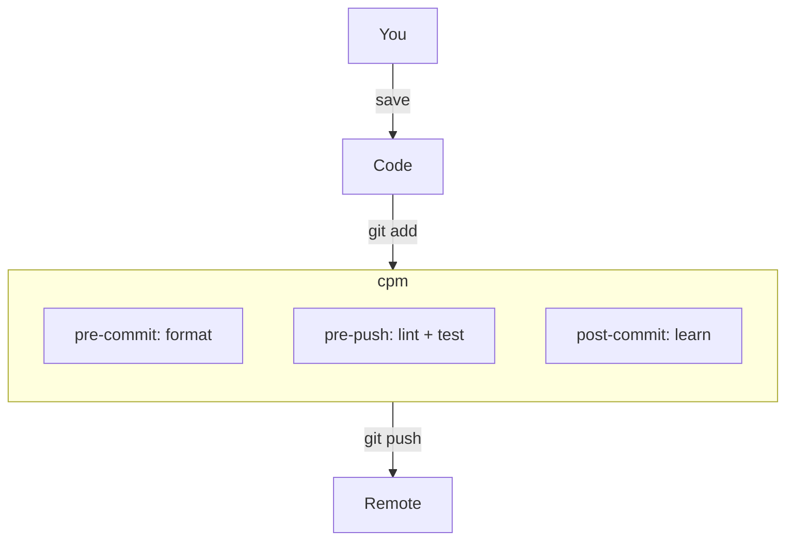
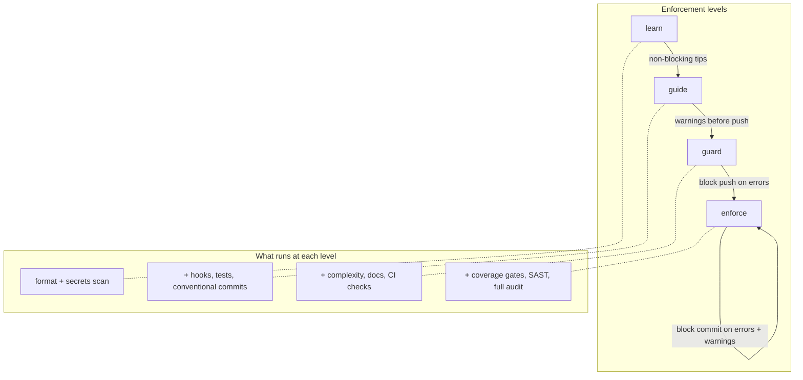

# cpm — code project maturity


A quality layer between git and your code. One binary, zero friction, any repo.


## How it works

cpm is a silent bolt-on that ties into your development workflow. It uses best practices to keep your code good enough from the start — or helps you improve gradually using [ISO 9126](https://en.wikipedia.org/wiki/ISO/IEC_9126) quality characteristics. Follow the preconfigured checks, tweak the settings, disable what you don't need, or add your own via `Makefile` targets.



## V-model: choose your depth

The idea is straightforward: introduce granularity levels to create a second dimension in your workflow. Based on the [V-model](https://en.wikipedia.org/wiki/V-model_(software_development)) from systems engineering.

Single dimension:

```text
task → code → test → release
```

Multi dimension (V-model): from coarse-grained to fine-grained and back — checking and testing at every level with a different mindset. Decisions, documentation, code, tests, and results — all linked, traceable, and enforced at your chosen level.

```text
Value              ───────►  Feature coverage, regression tests
  ╲                         ╱
  ADR (decision)   ─────►  End-to-end tests, traceability matrix
    ╲                     ╱
  Acceptance criteria ──► Integration tests, mutation tests
      ╲                 ╱
      Code ──► Unit tests + comment coverage + test coverage
```

cpm combines the tools you already use into one process: git, hooks, Makefile, config, and best-of-breed tools like [semgrep](https://semgrep.dev/), [gitleaks](https://github.com/gitleaks/gitleaks), [clang-format](https://clang.llvm.org/docs/ClangFormat.html), [eslint](https://eslint.org/), and more.



```toml
# cpm.toml — set your level
[enforcement]
level = "guide"    # learn | guide | guard | enforce
```

## Install

```bash
# Any platform (downloads pre-built binary from GitHub Releases)
curl -fsSL https://raw.githubusercontent.com/rkristelijn/cpm/main/install.sh | bash

# macOS
brew tap rkristelijn/cpm https://github.com/rkristelijn/cpm
brew install cpm

# From source (requires g++ with C++17)
git clone https://github.com/rkristelijn/cpm.git
cd cpm && make build && sudo make install
```

## Quick start

```bash
cd my-project
cpm init          # generates cpm.toml with sensible defaults
cpm check --fast  # format + build (pre-commit)
cpm check         # + lint + test (pre-push)
cpm check --full  # + coverage + sast (CI)
```

## Demo: scan a real repo

```bash
$ cpm scan ~/git/hub/console-log-json --depth 1

  Scanning (depth 1)...
  Found 1 repos

  [1/1] console-log-json                         5 findings

  Scan Report (1 repos)
  ─────────────────────────────────────────────
  Errors: 1 | Warnings: 4

$ cpm findings console-log-json
  error    node-eol              Node.js 14 is EOL — upgrade to 20+
  warning  unpinned-deps         Dependencies use ^ or ~
  warning  typescript-eol        TypeScript 4.x is EOL — upgrade to 5+
  warning  no-contributing       No CONTRIBUTING.md
  warning  no-agent-config       No AI agent config
```

No setup needed. No config. Point it at code and get actionable findings.

## Commands

| Command | Description |
|---------|-------------|
| `cpm init` | Create cpm.toml + .editorconfig + SECURITY.md + templates |
| `cpm check [--fast\|--full]` | Run quality gate (tiered) |
| `cpm score` | Show maturity score (0-100) + badge |
| `cpm scan <path>` | Scan repos for quality metrics |
| `cpm findings [repo]` | Query findings (--learn, --compliance, --junit) |
| `cpm sbom` | Generate Software Bill of Materials |
| `cpm lint` | Run all lint checks |
| `cpm format` | Auto-format all files |
| `cpm build` | Build the project |
| `cpm run` | Build and run |
| `cpm test` | Run tests |
| `cpm coverage` | Build with coverage and report |
| `cpm new <name>` | Create a new project |
| `cpm new test <name>` | Add a test file |
| `cpm new module <name>` | Add a module (cpp + hpp) |
| `cpm install` | Install tools from cpm.toml |
| `cpm eject` | Generate Makefile + CMakeLists.txt + configs |
| `cpm hook` / `unhook` | Install/remove git hooks |
| `cpm bump <major\|minor\|patch>` | Bump version in cpm.toml |
| `cpm get [key]` | Show config |
| `cpm set <key> <val>` | Update config |
| `cpm audit` | Check tool versions |
| `cpm tools` | Show installed tool versions |

## Quality checks (built-in)

58 checks across security, quality, supply chain, docs, and compliance:

| Category | Checks |
|----------|--------|
| Security | secrets, OWASP top 10, weak crypto, PII detection, env config, dangerous patterns |
| Architecture | circular deps, deep nesting, fan-out, infra coupling, dead code, mock-boundary |
| Quality | file size, complexity, comments, shadow variables, slop detection, test-to-code ratio |
| Dependencies | lockfile, version pins, audit (7 langs), license, outdated, runtime EOL |
| Supply Chain | lockfile integrity, pinned GitHub Actions, vendor lock-in |
| Web | framework misuse (React/Next/Nest/Angular), CORS, debug mode |
| Accessibility | WCAG violations, inclusivity (35 terms), unicode |
| Docs | prose lint (vale), spelling (cspell), inclusivity (alex), broken links (lychee) |
| DevOps | Makefile best practices, CI pipeline, .editorconfig, SECURITY.md, templates |
| Git Health | lottery factor, churn hotspots, large commits, stale repos |
| Compliance | ISO 27001, GDPR, CMMI, OWASP, WCAG, SOC 2 mapping |

Language-specific checks:

| Language | Checks |
|----------|--------|
| TypeScript/JS | audit, outdated, license, eslint, EOL, framework misuse |
| Python | audit, outdated, license, ruff, EOL, version constraint, formatter |
| Go | vulncheck, outdated, license, version EOL |
| Rust | cargo-audit, outdated, license, edition, unsafe detection |
| Java | OWASP audit, license, outdated, Spring Boot EOL |
| C# | audit, outdated, license |
| C++ | format, cppcheck, clang-tidy, complexity, comments, docs |
| PHP | audit, outdated, EOL |
| Ruby | bundle-audit, outdated, license |
| Dart/Flutter | analyze, pub outdated |
| Terraform | tflint, tfsec/trivy, lockfile, version |
| C++ | format, cppcheck, clang-tidy, complexity, comments, docs |

## Design principles

- **Zero friction** — works without config, without committing anything
- **One binary** — no runtime dependencies
- **Fast** — checks run in parallel, pre-commit < 5s
- **[Shift left](https://en.wikipedia.org/wiki/Shift-left_testing)** — fail fast, fail smart, fail at your level
- **Learn don't police** — every finding explains why and how to fix

See [ADR-013](docs/adrs/adr-013-product-positioning.md) for the full philosophy and [ADR-020](docs/adrs/adr-020-product-vision.md) for the product vision.

## [License](LICENSE)

MIT
