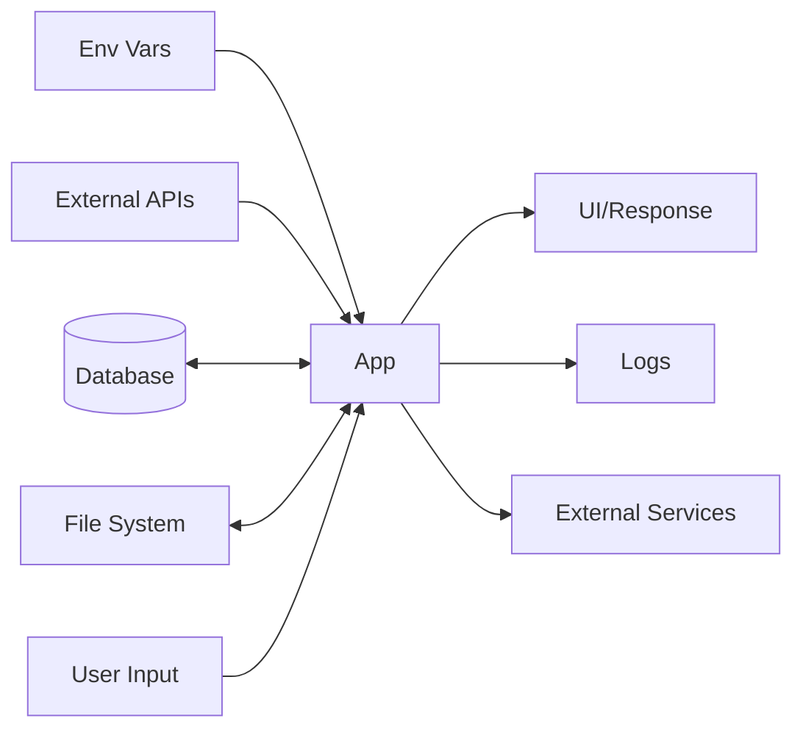

# Architecture & Technical Overview
> Auto-generated on 2026-05-17 by `cpm generate-docs`
> Source of truth: the code itself. This document is regenerated, never manually edited.

## Overview
```


■ Identity
  Name: cpm

■ Stack
   C++ Bash(96)

■ Entry points
  → src/main.cpp

■ Structure (top-level)
  .config/             2 files
  .cpm/                2 files
  .kiro/               1 files
  .tmp/                394 files
  checks/              61 files
  code-cpp-demo-app/   2 files
  docs/                147 files
  fixes/               11 files
  lib/                 19 files
  scripts/             31 files
  src/                 59 files
  tests/               18 files

■ Key files
  ✓ README.md
  ✓ CONTRIBUTING.md
  ✓ CHANGELOG.md
  ✓ Makefile
  ✓ cpm.toml

■ Public API / Commands
  Make targets:
    build
    clean
    install
    test
    test-unit
    coverage
    smoke
    version
    bump
    package

■ Hotspots (largest files)
   1161 lines  ./.tmp/docs/html/navtree.js
    844 lines  ./src/scan.cpp
    815 lines  ./src/commands.cpp
    708 lines  ./.tmp/docs/html/search/search.js
    627 lines  ./src/checks_test.cpp

■ Dependencies (top 8)

■ Recent activity (last 5 commits)
  eacea25 refactor(scripts): organize into discover/ and assess/ subdirectories
  093cae0 feat(maturity): cpm reaches Level 3 (68%) with coverage, e2e, pre-commit
  5a918b2 fix(maturity): improve Java/Maven project detection significantly
  121bfff fix(docs+maturity): detect sub-READMEs and templates/ as source
  a589cd7 feat(literals): extract hidden knowledge from string literals in code

■ Related repos (siblings in hub/):
  ai-credit                 CLI tool to track and analyze AI coding assistants
  ascii                     
  automater                 Scaffold modern web apps with best practices in se
  bla                       
  cli-keyboard-trainer      CLI keyboard trainer
  cloudflare-delete-all-deployments 

```

## Getting Started
```
■ How to run: cpm
Prerequisites:
Install:
  make install  (or: make)
Run (dev):
  make  (default target)
Test:
  make test
Build:
  make build
```

## Technology Stack
```
■ Tech Radar: cpm
  ✓ curl                      HTTP client
  ✓ jq                        JSON processor
  ✓ awk                       Text processing
  ✓ git                       Version control API
  ✓ terraform                 IaC
  ✓ Runs in: GitHub Actions   Pipeline-driven
  ✓ GraphQL                   
  ✓ Password hashing          bcrypt/argon2
  ✓ RBAC                      Role-based access
  ✓ CSS-in-JS                 styled/emotion
  ✓ Bootstrap                 
  ✓ Joi                       
  ✓ class-validator           Decorator-based
  ✓ GitHub Actions            2 workflows
  ✓ dotenv (.env files)       
  ✓ TODO/FIXME/HACK           3 markers
  ✓ JSDoc/Doxygen blocks      105
  ✓ README.md                 192 lines
  ✓ CONTRIBUTING.md           exists
  ✓ CHANGELOG.md              exists
  ✓ docs/                     152 files
  ✓ Inline comments (//)      9
```

## Design Patterns
```
■ Detected patterns: cpm
✓ Hexagonal (Ports & Adapters)        port/adapter/domain/infrastructure dirs
✓ Singleton                           getInstance() or private constructor
✓ Observer / Pub-Sub                  subscribe/emit/EventEmitter
✓ Strategy                            Strategy interface or pattern
✓ Decorator                           @ decorators (Angular/NestJS/Python)
✓ Repository                          Repository class/interface
✓ Dependency Injection                inject/constructor injection
✓ Command / CQRS                      Command + Handler pattern
✓ Middleware / Pipeline               middleware chain (Express/Koa style)
✓ State Management                    Redux/NgRx/Zustand/Signals
✓ Reactive (RxJS)                     Observable/pipe/operators
✓ Functional Programming              map/filter/reduce/compose
```

## Data Flow


## Maturity
```
  ✓ Has source code
  ✓ Has README.md
  ✓ Has .gitignore
  ✓ Has LICENSE
  · Has lockfile
  ✓ Has linter config
  · Has formatter config
  ✓ Has test script/config
  ✓ Has CI/CD pipeline
  · Runtime version pinned
  ✓ Has test files
  ✓ Has CHANGELOG
  ✓ Has conventional commits
  ✓ Has docs/ folder
  ✓ Has CONTRIBUTING.md
  · Has .env.example
  ✓ Has coverage config
  ✓ Has E2E tests
  · Has security scanning
  · Has monitoring/APM
  ✓ Has pre-commit hooks
  ✓ Has architecture docs (ADRs)
  · Has API documentation
  · Has feature flags
  · Has CODEOWNERS
  ✓ Has SLA/SLO defined
Score: 24/35 (68%) — Level 3 (Measured)
```

## Key Metrics
| Metric | Value |
|--------|-------|
| Total files | 758 |
| Lines of code | 19501 |
| Generated | 2026-05-17 |

---
*This document is auto-generated. Run `bash scripts/generate-docs.sh .` to update.*
