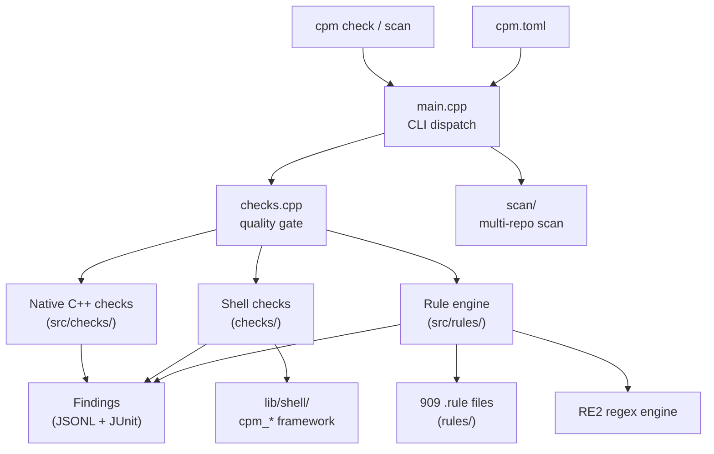

# Architecture

> ⚠️ **Updated 2026-08-30** — This replaces the previous auto-generated version which was outdated and inaccurate. This document reflects the actual codebase structure as verified by manual inspection.

## Overview

cpm is a single C++20 binary (~87 source files) with zero runtime dependencies beyond POSIX. It scans code projects for quality, security, and maturity — combining three check layers:

| Layer | Count | Technology | Location |
|-------|-------|------------|----------|
| Rule engine | 909 rules (54 categories) | Declarative `.rule` files, RE2 regex | `rules/` |
| Shell checks | 188 scripts | Bash (Gen1/Gen2 framework) | `checks/` |
| Native C++ checks | ~30 | Compiled into binary | `src/checks/` |
| **Total** | **1043** | | |

## Source structure

```text
src/
├── main.cpp              # CLI dispatch (thin — delegates everything)
├── checks.cpp            # Quality gate orchestration (--fast/--full tiers)
├── checks.h
├── line_scanner.h        # Single-pass file scanner
├── analysis/             # Import graph, tokenizer (circular deps, complexity)
├── checks/               # Native C++ checks
│   ├── quality/          # Code smells, complexity, dead code, a11y, etc.
│   ├── security/         # Secrets detection, API security
│   ├── deps/             # Lockfile, version pins, runtime EOL
│   ├── docs/             # Doc structure, cognitive complexity, style
│   └── style/            # Unicode checks
├── commands/             # CLI commands (init, new, sort, ops)
├── common/               # Shared: toml parser, runner, UI, setup, constants
├── io/                   # Filesystem abstraction (+ mock for tests)
├── report/               # JUnit XML output
├── rules/                # Rule engine (parse .rule → RE2 scan)
├── runners/              # Tool runner (external tool invocation)
└── scan/                 # Multi-repo scan, language detection, compliance
```

## Data flow



## Key design decisions

**Fork-join parallelism** — `cpm_run_parallel()` in `src/common/runner.cpp` uses POSIX `fork()/waitpid()` instead of threads. Each check runs in its own process with natural isolation, no shared state, and no mutex complexity. The parent forks all children at once, then waits in order to collect results.

**Rule engine** — 909 declarative `.rule` files are parsed by `src/rules/rule_engine.cpp` and executed as single-pass RE2 regex scans. Five engine modes: `pattern`, `absence`, `presence`, `file-absence`, `file-presence`. Rules support `scope: 1-10` for line-range limiting. See [ADR-145](adrs/adr-145-pluggable-rule-engine.md) and [ADR-166](adrs/adr-166-rule-engine-extensions.md).

**Shell framework (Gen1 → Gen2)** — Shell checks in `checks/` source `lib/shell/init.sh` which provides the `cpm_*` function family: `findings_add()`, `cpm_search()`, timers, config parsing, and structured JSONL output. Gen2 (via `check.sh`) is the target; ~62 scripts still use Gen1 patterns. See [R-031](research/R-031-cpm-refactor-plan.md) for migration plan.

**Single dispatch table** — `main.cpp` is intentionally thin. It maps `argv[1]` to handler functions. Commands that don't need `cpm.toml` (init, new, scan) dispatch first; the rest parse config before dispatch.

**External dependency: RE2 only** — The regex engine ([google/re2](https://github.com/google/re2)) is the sole external C++ dependency. See [ADR-164](adrs/adr-164-regex-engine-strategy.md).

## Build

```bash
make build    # g++ with C++20, links RE2
make test     # 289 tests (unit + integration)
make install  # → /usr/local/bin/cpm
```

## Conventions

- **`cpm_` prefix** — All public C++ functions and shell framework functions use this prefix
- **Findings as data** — Every check (native, shell, rule) emits structured JSONL findings
- **Enforcement levels** — `learn → guide → guard → enforce` (configured in `cpm.toml`)

## Related documents

| Document | What it covers |
|----------|----------------|
| [ADR-022](adrs/adr-022-native-cpp-architecture.md) | Why C++ over alternatives |
| [ADR-129](adrs/adr-129-unified-findings-contract.md) | Unified findings contract |
| [ADR-130](adrs/adr-130-test-architecture.md) | Test architecture |
| [ADR-145](adrs/adr-145-pluggable-rule-engine.md) | Pluggable rule engine |
| [ADR-164](adrs/adr-164-regex-engine-strategy.md) | RE2 regex strategy |
| [ADR-165](adrs/adr-165-analysis-engine.md) | Analysis engine |
| [ADR-166](adrs/adr-166-rule-engine-extensions.md) | Rule engine extensions |
| [ADR-168](adrs/adr-168-multi-engine-architecture.md) | Multi-engine architecture |
| [R-031](research/R-031-cpm-refactor-plan.md) | Refactor plan (Gen1→Gen2, consistency) |
| [R-029](research/R-029-production-readiness.md) | Production readiness assessment |
