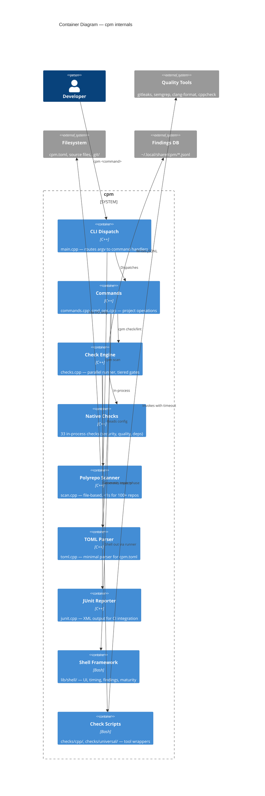

# C4 Container Diagram — cpm

Shows the internal structure of the cpm binary and its runtime components.

## Container responsibilities

| Container | Responsibility | Performance target |
|-----------|---------------|-------------------|
| CLI Dispatch | Route command, detect recursion, show version | <1ms |
| Commands | Build, test, format, hooks, config, eject | Varies |
| Check Engine | Parallel execution, tiering, mock support | <60s (default tier) |
| Native Checks | In-process file analysis, no tool deps | <5s total |
| Scanner | Discover repos, score maturity, emit findings | <1s for 100+ repos |
| TOML Parser | Parse cpm.toml, provide defaults | <1ms |
| JUnit Reporter | Serialize findings to XML | <10ms |
| Shell Framework | TUI output, timing, git operations | N/A |
| Check Scripts | Wrap external tools, parse output | Per-tool timeout |

## Design decisions

- **C++ binary + bash scripts**: binary for speed (scan, native checks), bash for tool orchestration (portable, inspectable)
- **Fork-based parallelism**: each check runs in a child process (isolation, no shared state)
- **JSONL findings**: append-only, streamable, queryable without a database
- **Tiered gates**: fast (<5s) for pre-commit, default (<60s) for pre-push, full for CI
- **CPM_MOCK**: env var skips tool execution for instant e2e testing
