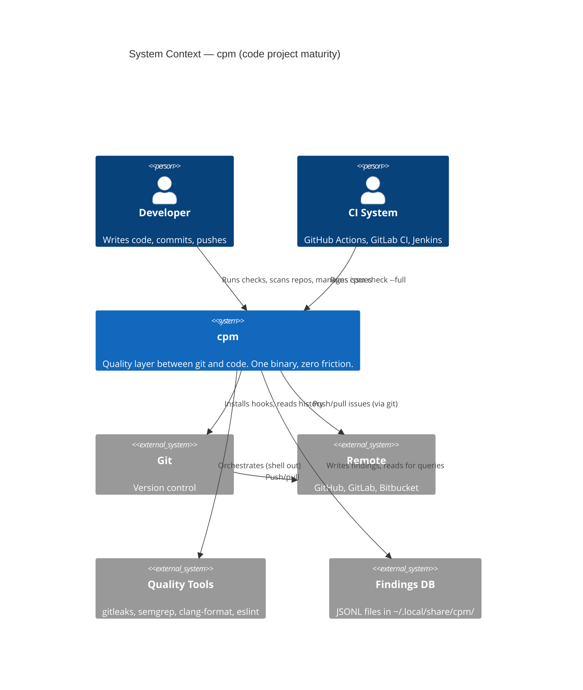

# C4 Context Diagram — cpm

Shows cpm's position in the developer ecosystem.

## Key relationships

| From | To | Interaction |
|------|-----|-------------|
| Developer | cpm | CLI commands (check, scan, init, issue) |
| cpm | Git | Hook installation, log parsing (DORA metrics) |
| cpm | Quality Tools | Shell out with timeout, parse output |
| cpm | Findings DB | JSONL append (write), query (read) |
| CI | cpm | `cpm check --full` in pipeline |
